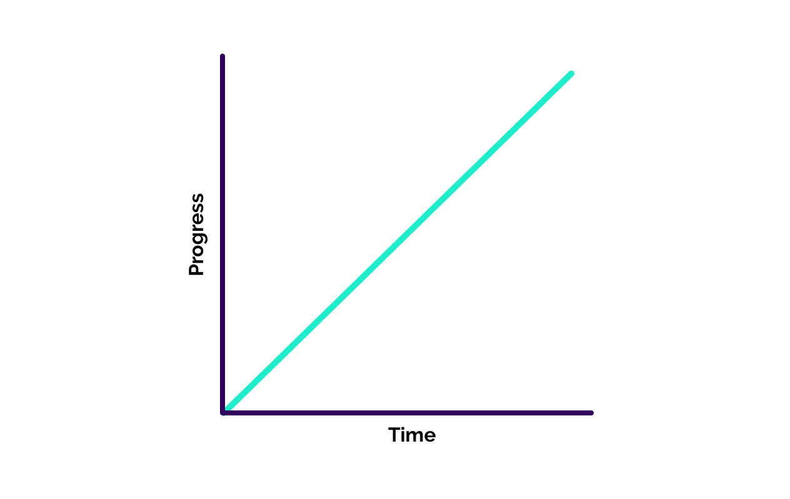
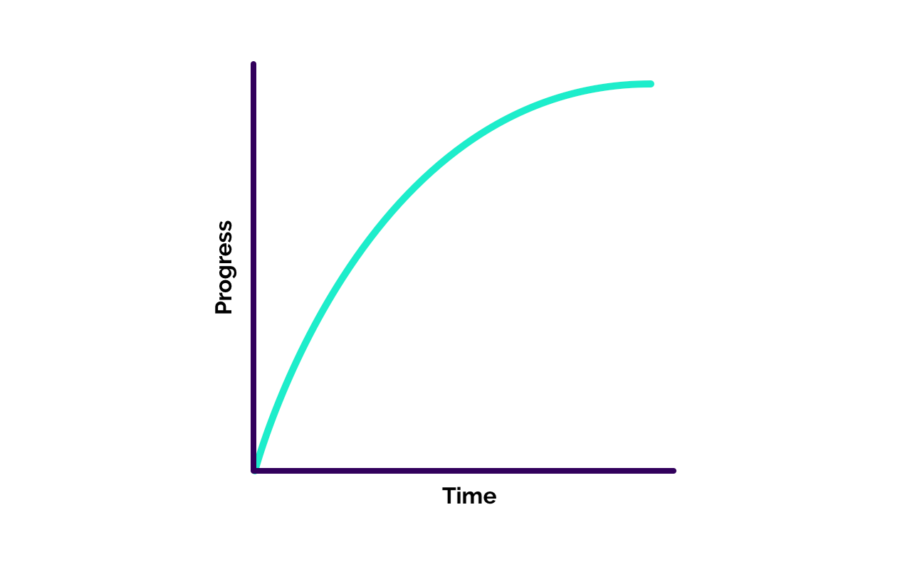

"Don't reinvent the wheel" is sage advice. In production, it's almost always better to leverage battle-tested software over rolling your own.

But if you want to **learn**, forget it. Making your own version of existing libraries can not only help you become a better software developer, but also improve your ability to think critically about the software you do consume in production.

In that spirit, by the end of this post we're going to better understand the inner-workings of the bedrock of UI animation, the tween, by making one from scratch.

## A what now?

A tween! Even if you haven't heard the term before, if you've done UI animation it's likely you've used one before.

The name of the function can differ. [GreenSock's TweenMax](https://greensock.com/) calls it `to`. [Anime](https://animejs.com) calls it `anime`. My own [Popmotion](https://popmotion.io) calls it a `tween`.

But the functionality isn't exclusive to JavaScript. If you've ever written CSS like this:

```css
div {
  transition: all 300ms ease-out;
}
```

That's defining a tween too!

A tween is just an **animation between two values, over a duration of time**.

The term originated as a abbreviation for "inbetweening". It's a process where a cartoon's lead illustrators would define the **keyframes** of the animation, and then pass those off to the cheaper labour. They'd fill in the missing frames with transitional illustrations. Inbetweening.

I first encountered the word "tween" in Flash (ask your parents). Adobe's skeuomorphic naming of tools meant that on the timeline you'd place keyframes and Flash would tween between those.

So the term itself is actually an anachronism. In [React Native's Animated](https://facebook.github.io/react-native/docs/animated) they call it a `timing` animation, which might be more immediately obvious to modern readers.

Back in those Flash days, I used to use Greensock's TweenMax library to write tween animations. There was something about it that seemed magical, like it was tapping into a special Flash API that I didn't understand. It was only when I wrote Popmotion that I realised that making animations really is just a matter of changing values gradually, once per frame.

## What we'll make

By the end of this post we'll have a `tween` function that looks like this:

```javascript
tween({
  from: 0,
  to: 100,
  duration: 300,
  onUpdate: v => console.log(v)
});
```

<iframe height="400" style="width: 100%;margin-bottom:40px" scrolling="no" title="Write your own tween (completed)" src="//codepen.io/popmotion/embed/preview/LaRxLR/?height=400&theme-id=17364&default-tab=js,result" frameborder="no" allowtransparency="true" allowfullscreen="true"></iframe>

The easiest way to follow along with the tutorial is to fork [this CodePen](https://codepen.io/popmotion/pen/zbGYxp?editors=0011). It's already set up with an open console, modern JavaScript support, and a `div` that we'll use our completed `tween` function to animate.

## The function

Let's start by writing our function. I'm going to call mine `tween` but you can call yours anything. If there's a name you prefer, [answers on a postcard](https://twitter.com/mattgperry).

It's going to take a single argument, a configuration object.

```javascript
function tween(config = {}) {}
```

This configuration object should be set up with some sensible defaults to make life easier for users of this function.

In Popmotion I've gone with `from: 0` and `to: 1`, because the range `0`-`1` often comes in handy when writing animations and GPU shaders.

The full extent of its use is beyond the scope of this article but, as `0` represents "none of something" or "zero progress" and `1` represents "all of something" or "completed progress" you can probably imagine that it's a simple, standard way to think about ranges.

I also chose a `duration` of `300` milliseconds as I think it strikes a nice balance of being snappy but not abrupt.

To set these defaults, we can use [destructuring](https://developer.mozilla.org/en-US/docs/Web/JavaScript/Reference/Operators/Destructuring_assignment) syntax.

```javascript
function tween({ from = 0, to = 1, duration = 300 } = {}) {}
```

You can verify your function is working with these defaults by adding a `console.log` to your function, and then immediately calling it:

```javascript
function tween({ from = 0, to = 1, duration = 300 } = {}) {
  console.log(duration);
}

tween();
```

The console panel will say `300`. If you pass in your own `duration`:

```javascript
tween({ duration: 1000 });
```

It will show that instead.

That's the skeleton of our function working, now we need to make it run an animation.

## The animation loop

Remember what "tween" is short for: "inbetweening". We have our `from` and `to` values, those are our keyframes. So now we need to, over the course of `duration`, generate values that are inbetween those two.

To do this, we're going to use the [`requestAnimationFrame` function](https://developer.mozilla.org/en-US/docs/Web/API/window/requestAnimationFrame). This is a function that allows you to ask the browser to run some code before the next frame is rendered.

Inside the `tween` function, we're going to make a new function called `update`. We're going to run this function once every frame.

Inside the `tween` function, make a new function called `update`. In it, place a `console.log` so we know it's running.

```javascript
function tween({ from = 0, to = 1, duration = 300 } = {}) {
  function update() {
    console.log("update!");
  }
}
```

At the end of `tween`, use `requestAnimationFrame` to call `update`:

```javascript
function tween({ from = 0, to = 1, duration = 300 } = {}) {
  function update() {
    console.log("update!");
  }

  requestAnimationFrame(update);
}
```

Now when you call `tween`, your console will ping `"update!"`.

Most monitors render at 60 frames a second. There's some edge-cases, for instance when iOS is in low-power mode, Safari runs at 30 frames a second. But to make animation appear smooth, you need to call `requestAnimationFrame` once for every single frame!

At the end of `update`, add the same line of code again. A `requestAnimationFrame`, calling `update`:

```javascript
function update() {
  console.log("update!");
  requestAnimationFrame(update);
}
```

This will schedule another call to `update` for the **next** frame, thereby starting a frame-synced loop.

## Calculate elapsed

A `tween` is a duration-based animation, so the key piece of information we need is the progress of the animation, which we derive from the amount of time that's elapsed.

The simplest way to do this is to record the time the animation starts, and then every frame measure how much time has elapsed since then.

To do this, we can use the browser's `performance.now` function. This returns a timestamp, the number of milliseconds since the page session started.

```javascript
function tween({ from = 0, to = 1, duration = 300 } = {}) {
  const startTime = performance.now();

  function update() {
    console.log("update!");
    requestAnimationFrame(update);
  }

  requestAnimationFrame(update);
}
```

`rAF` calls the function given to it with a single argument, the timestamp of the current frame. So we can use the difference between that and `startTime` to calculate `elapsed`:

```javascript
const startTime = performance.now();

function update(currentTime) {
  const elapsed = currentTime - startTime;
```

## Derive progress

Now that we have an `elapsed` value, we can figure out `progress`. `progress` is a value between `0` and `1`, and as mentioned earlier `0` represents no progress and `1` represents a completed animation.

The calculation for this is `elapsed` divided by `duration`. Essentially a percentage calculation without multiplying by `100` at the end:

```javascript
const progress = elapsed / duration;
```

To explain, think of an animation of `1000` millisecond duration that has been running for `500` milliseconds:

```javascript
const progress = 500 / 1000; // 0.5
```

`0.5` represents half way through the animation, which is correct.

We want to clamp `progress` to no greater than `1`, so for this we can use `Math.min`, which returns the smallest of the numbers provided to it:

```javascript
const progress = Math.min(elasped / duration, 1);
```

We also want to automatically stop the tween when `progress` is `1`, so let's wrap our self-calling `rAF` with a check that does just that:

```javascript
function update(currentTime) {
  const elapsed = currentTime - startTime;
  const progress = Math.min(elasped / duration, 1);

  if (progress < 1) {
    requestAnimationFrame(update);
  }
}
```

## Calculate tweened values

Now we're ready to use `progress` to calculate our tweened values!

First, we need to calculate the distance (or the `delta`) between `to` and `from`. We can do this by subtracting `to` from `from` at the start of the `tween` function:

```javascript
const delta = to - from;
```

This gives us a `delta` value which, when we add back to `from`, will return `to`. By multiplying `delta` with the frame's `progress` before adding it to `from`, we'll get the correct value for that frame:

```javascript
const latest = from + progress * delta;
```

The way this works is, when we multiply `delta` by `0` (no progress), `latest` will be the same as `from`. When we multiply `delta` by `1` (completed tween) and add that to `from`, we receive `to`.

Now if you `console.log(latest)`, you can see your tween works!

Here's how your function should look:

```javascript
function tween({ from = 0, to = 1, duration = 300 } = {}) {
  const delta = to - from;
  const startTime = performance.now();

  function update(currentTime) {
    const elapsed = currentTime - startTime;
    const progress = Math.min(elapsed / duration, 1);
    const latest = from + progress * delta;

    if (progress < 1) {
      requestAnimationFrame(update);
    }
  }

  requestAnimationFrame(update);
}
```

## Animate the ball

Of course, animations are no good if they don't animate anything. So we need to provide a way for people to define a render target which, in this case, is going to be the ball `div` on the CodePen.

Add `onUpdate` to the config:

```javascript
function tween({ from = 0, to = 1, duration = 300, onUpdate } = {}) {
```

This is going to be a function that a user can configure to fire once every frame.

On the line after we calculate `latest`, call `onUpdate` with `latest`:

```javascript
if (onUpdate) onUpdate(latest);
```

After your `tween` function, cache a reference to the `#ball` element.

```javascript
const ball = document.getElementById("ball");
```

Now we can define an `onUpdate` property in our call to `tween` that uses its output to change `opacity`:

```javascript
tween({
  duration: 1000,
  onUpdate: v => {
    ball.style.opacity = v;
  }
});
```

Success! You can animate any value this way. For instance `translateX`:

```javascript
tween({
  from: 0,
  to: 300,
  onUpdate: v => {
    ball.style.transform = `translateX(${v}px) translateZ(0)`;
  }
});
```

## Easing

When you animate `x` you might notice something about the motion that feels a little stifled. That's because we're doing a `linear` tween, which means `progress` has a linear relationship to time.



In other words, `progress` changes at a constant rate as the animation progresses.

In the real world, stuff doesn't often move at a constant rate. It tends to accelerate and/or decelerate.

We can replicate this kind of motion in a tween using **easing**. Easing functions take a `progress` value and return a new one. For instance, the `linear` easing shown above looks like this:

```javascript
function linear(progress) {
  return progress;
}
```

The precise way an easing function affects `progress` varies, but you can play with different easing curves at [Lea Verou's Cubic Bezier playground](http://cubic-bezier.com/#.17,.67,.83,.67) to get a feel for how different curves affects the feel of an animation.

A full exploration of easing is a post of its own. But for now let's make our `tween` capable of accepting different easing functions.

Add this `easeOut` function to the top of your JavaScript:

```javascript
function easeOut(progress, power = 2) {
  return 1 - (1 - progress) ** power;
}
```

This starts motion fast, and gradually slows over the course of the animation.



In your `tween` function, make this the default `ease`:

```javascript
function tween({
  from = 0,
  to = 1,
  duration = 300,
  ease = easeOut,
  onUpdate
} = {}) {
```

I prefer using this as a default over `linear` because most UI animations should happen as a result of a user's action. To make it feel like the user is imparting their own energy into the UI, I prefer to start those animations fast and let them slow down on their own.

If an animation is happening **not** as a direct result of a user's input, an easing function that starts a little slower is better, to grab the user's attention before they miss what's changing.

To use this `ease` function in our animations we need to replace the `progress` we use in our `latest` calculation with the amended version returned from `ease`.

```javascript
const latest = from + ease(progress) * delta;
```

Now the animation feels more natural. Different easing functions work well with different properties, and work with different `duration`s.

<iframe height="400" style="width: 100%;margin-bottom:40px" scrolling="no" title="Write your own tween (completed)" src="//codepen.io/popmotion/embed/preview/LaRxLR/?height=400&theme-id=17364&default-tab=js,result" frameborder="no" allowtransparency="true" allowfullscreen="true"></iframe>

## Next steps

And there you have a basic `tween` function!

There's plenty we can do to improve its usability and functionality. Here's a couple ideas for you to explore:

- Adding support for units, colors and other value types (hint: you can use a function like [Popcorn's `interpolate`](https://popmotion.io/popcorn/api/interpolate/))
- Return an API with methods like `pause`, `resume`, `stop` and `seek`.

Let me know how you get on [over at Twitter](https://twitter.com/mattgperry)!
